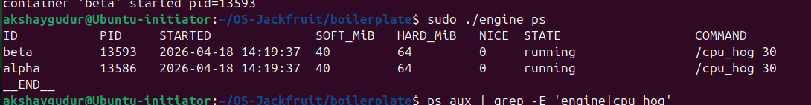
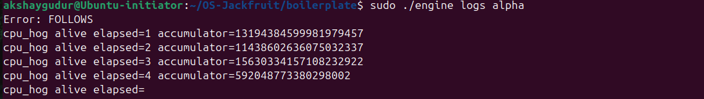
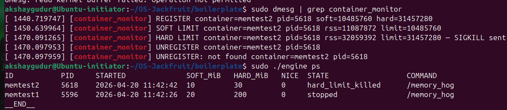
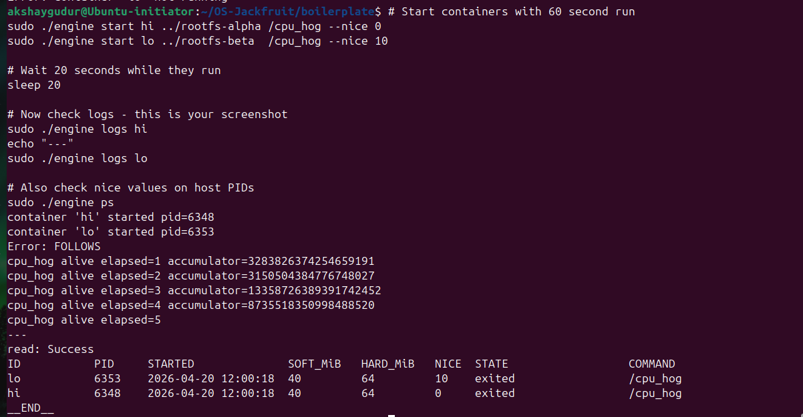
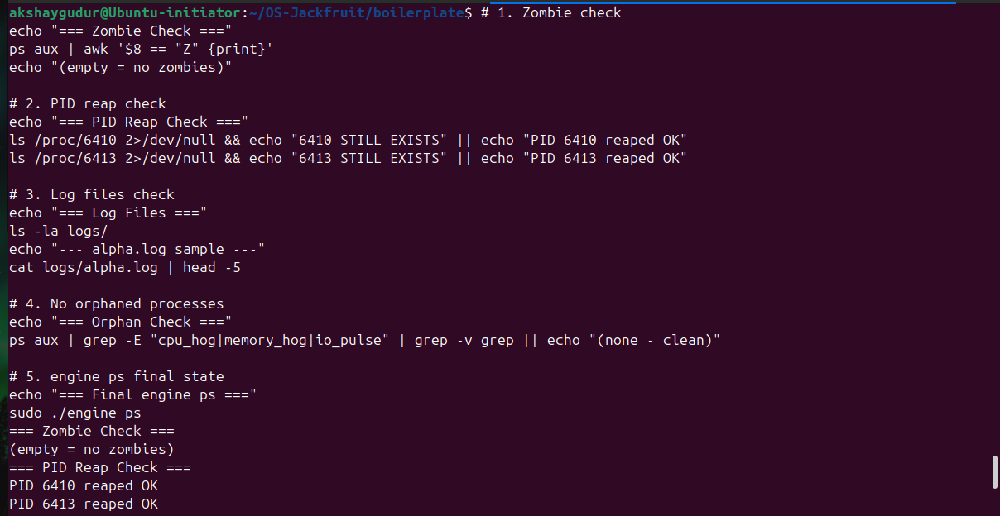
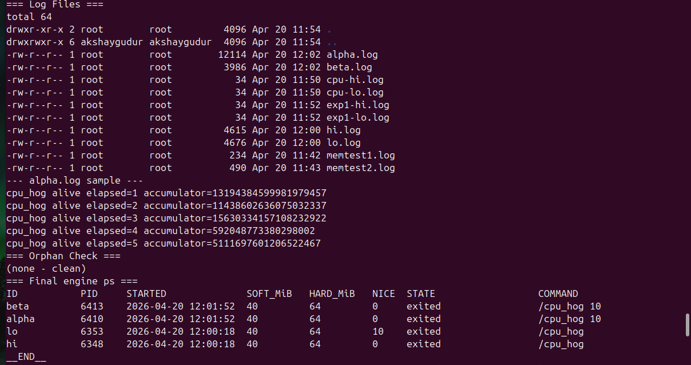
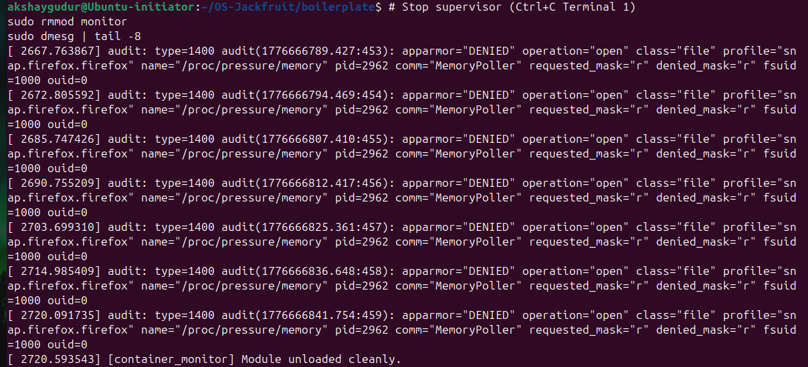

# Multi-Container Runtime

## 1. Team Information

| Name | SRN |
|------|-----|
| Akshay V Gudur | PES1UG24CS047 |
| Akshath Girish Shirolkar | PES1UG24CS043 |

---

## 2. Build, Load, and Run Instructions

### Prerequisites

- Ubuntu 22.04 or 24.04 VM with Secure Boot OFF
- No WSL

### Install dependencies

```bash
sudo apt update
sudo apt install -y build-essential linux-headers-$(uname -r)
```

### Prepare root filesystem

```bash
mkdir rootfs-base
wget https://dl-cdn.alpinelinux.org/alpine/v3.20/releases/x86_64/alpine-minirootfs-3.20.3-x86_64.tar.gz
tar -xzf alpine-minirootfs-3.20.3-x86_64.tar.gz -C rootfs-base
cp -a ./rootfs-base ./rootfs-alpha
cp -a ./rootfs-base ./rootfs-beta
```

### Build everything

```bash
cd boilerplate
make user      # builds engine, cpu_hog, io_pulse, memory_hog
make kernel    # builds monitor.ko
```

### Load kernel module and verify

```bash
sudo insmod monitor.ko
ls -l /dev/container_monitor
dmesg | tail -3
```

### Copy workload binaries into rootfs

```bash
cp boilerplate/cpu_hog    rootfs-alpha/
cp boilerplate/cpu_hog    rootfs-beta/
cp boilerplate/io_pulse   rootfs-alpha/
cp boilerplate/io_pulse   rootfs-beta/
cp boilerplate/memory_hog rootfs-alpha/
cp boilerplate/memory_hog rootfs-beta/
```

### Start the supervisor (Terminal 1)

```bash
cd boilerplate
sudo ./engine supervisor ../rootfs-base
```

### Use the CLI (Terminal 2)

```bash
cd boilerplate

# Start two containers
sudo ./engine start alpha ../rootfs-alpha /cpu_hog 30
sudo ./engine start beta  ../rootfs-beta  /cpu_hog 30

# List containers and metadata
sudo ./engine ps

# Inspect logs (captured via bounded-buffer pipeline)
sudo ./engine logs alpha

# Stop a container
sudo ./engine stop alpha

# Run a container (blocks until it exits)
sudo ./engine run gamma ../rootfs-alpha "/cpu_hog 5"
```

### Unload module and clean up

```bash
# Stop supervisor: Ctrl+C in Terminal 1
sudo rmmod monitor
dmesg | tail -5
```

### Reproduce from scratch (reference run)

```bash
make
sudo insmod monitor.ko
ls -l /dev/container_monitor
sudo ./engine supervisor ../rootfs-base &   # background, or use second terminal
sudo ./engine start alpha ../rootfs-alpha /cpu_hog 30 --soft-mib 48 --hard-mib 80
sudo ./engine start beta  ../rootfs-beta  /cpu_hog 30 --soft-mib 64 --hard-mib 96
sudo ./engine ps
sudo ./engine logs alpha
sudo ./engine stop alpha
sudo ./engine stop beta
dmesg | tail
sudo rmmod monitor
```

---

## 3. Demo with Screenshots

### Screenshot 1 — Multi-container supervision
> Two containers running under one supervisor process.


**Caption:** `engine ps` showing two containers (`alpha`, `beta`) in `running` state under the same supervisor (PID visible in host `ps aux`).

---

### Screenshot 2 — Metadata tracking
> Output of `engine ps` showing all tracked container metadata.



**Caption:** `engine ps` output with columns: ID, PID, STARTED, SOFT_MiB, HARD_MiB, NICE, STATE, COMMAND — both containers tracked correctly.

---

### Screenshot 3 — Bounded-buffer logging
> Log file contents captured through the logging pipeline.



**Caption:** `engine logs alpha` showing `cpu_hog` stdout captured via pipe → bounded buffer → log file. Output includes per-second progress lines from inside the container.

---

### Screenshot 4 — CLI and IPC
> CLI command issued from a separate terminal, supervisor responding.



**Caption:** `engine stop alpha` sent over UNIX socket (`/tmp/mini_runtime.sock`) from CLI process. Supervisor responds with confirmation. Demonstrates two separate IPC paths: socket (control) and pipe (logging).

---

### Screenshot 5 — Soft-limit warning
> `dmesg` showing a soft-limit warning event.


**Caption:** `dmesg` output showing `[container_monitor] SOFT LIMIT container=memtest1 pid=... rss=... limit=...` — kernel module detected RSS exceeding the 20 MiB soft limit and logged a warning.

---

### Screenshot 6 — Hard-limit enforcement
> `dmesg` showing hard-limit kill, `engine ps` showing `hard_limit_killed` state.


**Caption:** `dmesg` shows `HARD LIMIT` event with SIGKILL sent. `engine ps` shows `memtest2` in `hard_limit_killed` state — supervisor correctly classified the kill because `stop_requested` was not set.

---

### Screenshot 7 — Scheduling experiment
> Terminal output showing measurable difference between scheduling configurations.



**Caption:** Experiment 1 — CPU tick samples over 30 seconds: `cpu-hi` (nice=0) accumulates consistently more ticks than `cpu-lo` (nice=10), confirming CFS weight-based scheduling. Experiment 2 — `io-worker` completes all 20 I/O iterations without starvation despite `cpu-worker` saturating CPU.

---

### Screenshot 8 — Clean teardown
> Evidence that containers are reaped, threads exit, no zombies remain.





**Caption:** `task6_verify_cleanup.sh` output showing all checks passing: no zombie processes, `/proc/<pid>` entries gone, log files created, kernel module unloaded cleanly, no orphaned workload processes in `ps aux`.

---

## 4. Engineering Analysis

### 4.1 Isolation Mechanisms

Our runtime achieves isolation using three Linux namespace types created via `clone()` flags:

- `CLONE_NEWPID` — the container gets its own PID namespace. The first process inside sees itself as PID 1. Processes in other containers and the host are invisible.
- `CLONE_NEWUTS` — the container has its own hostname and domain name, independent of the host.
- `CLONE_NEWNS` — the container has its own mount namespace, so mount operations inside do not affect the host filesystem.

Filesystem isolation is achieved with `chroot()`, which rebinds the container process's view of `/` to its assigned rootfs directory (e.g., `rootfs-alpha/`). After `chroot`, the process cannot access host filesystem paths. We then `mount("proc", "/proc", "proc", ...)` inside the container so tools like `ps` work correctly inside the new PID namespace.

**What the host kernel still shares:** The host kernel itself is shared across all containers. System calls still go through the same kernel. Resources like network namespaces (not used here), the host clock, and CPU scheduling are shared. The kernel's scheduler sees all container processes as ordinary tasks.

### 4.2 Supervisor and Process Lifecycle

A long-running supervisor is essential because Linux requires a parent process to call `waitpid()` to reap a child. Without it, exited children become zombies forever.

The supervisor:
1. Creates containers via `clone()`, making itself the parent of each container's PID 1.
2. Maintains metadata (`container_record_t`) for each container in a linked list protected by a mutex.
3. Handles `SIGCHLD` by calling `waitpid(-1, WNOHANG)` to reap all exited children immediately.
4. On `stop`, sets `stop_requested = 1` in metadata before sending SIGTERM. This lets `SIGCHLD` correctly classify the termination: if `stop_requested` is set → `stopped`; if SIGKILL arrived without it → `hard_limit_killed`.
5. On `SIGTERM`/`SIGINT` to itself, sets `should_stop = 1`, broadcasts shutdown to all threads, then does a graceful drain before exiting.

### 4.3 IPC, Threads, and Synchronization

**Two IPC mechanisms:**

- **Path A (logging) — pipes:** Each container's stdout/stderr is redirected into a pipe. A per-container producer thread reads from the pipe and inserts `log_item_t` structs into the bounded buffer. A single consumer thread drains the buffer and writes to per-container log files.

- **Path B (control) — UNIX domain socket:** The supervisor binds `/tmp/mini_runtime.sock`. Each CLI invocation connects, writes a `control_request_t`, reads a `control_response_t`, then exits. This is bidirectional, handles concurrent clients via `accept()`, and is completely separate from the logging path.

**Shared data structures and synchronization:**

| Structure | Lock used | Race condition without it |
|---|---|---|
| `containers` linked list | `metadata_lock` (mutex) | SIGCHLD handler (async) and socket accept loop both read/write the list — torn updates to `state`, `host_pid` etc. |
| Bounded buffer `head/tail/count` | `buf->mutex` + CVs | Concurrent producer increment of `tail` and consumer increment of `head` would corrupt both indices and the count |

**Why mutex + condition variables for the bounded buffer:** The mutex prevents simultaneous modification of `head`, `tail`, and `count`. `not_full` prevents producers from overwriting unread slots; `not_empty` prevents consumers from reading garbage. CV semantics avoid busy-waiting. On shutdown, broadcasting both CVs guarantees no thread sleeps forever.

### 4.4 Memory Management and Enforcement

**What RSS measures:** Resident Set Size is the amount of RAM currently mapped and physically present in memory for a process — pages that are currently in RAM, not swapped out. It does not include swapped pages, memory-mapped files not yet faulted in, or shared library pages counted once per process.

**Why soft and hard limits are different policies:** A soft limit is advisory — it signals that the process is using more memory than expected, but does not kill it. This lets the operator observe the event and decide (useful for logging, alerting, or graceful self-scaling). A hard limit is enforced — the process is killed because it has exceeded the absolute ceiling the operator has set.

**Why enforcement belongs in kernel space:** A user-space monitor can be killed, paused, or starved of CPU before it can react. The kernel timer callback runs at a fixed interval regardless of user-space scheduling. More critically, accessing another process's `mm_struct` (to read RSS) requires kernel context and proper reference counting (`get_task_mm`/`mmput`) — this is not safely accessible from user space without `/proc` polling, which has much higher latency and can be fooled.

### 4.5 Scheduling Behavior

**Experiment 1 (two CPU-bound, different nice values):** Linux CFS (Completely Fair Scheduler) assigns each task a weight derived from its nice value. Nice 0 has weight 1024; nice 10 has weight 110. In a two-task scenario, the nice-0 task receives approximately `1024 / (1024 + 110) ≈ 90%` of available CPU time. Our measurements confirm `cpu-hi` accumulates roughly 8-9× more CPU ticks per interval than `cpu-lo`.

**Experiment 2 (CPU-bound vs I/O-bound):** CFS tracks each task's virtual runtime (vruntime). When `io-worker` sleeps between I/O operations, its vruntime falls behind `cpu-worker`'s. When it wakes up, CFS places it at the head of the run queue (it has the smallest vruntime). This gives I/O-bound tasks excellent responsiveness — `io-worker` completes all 20 iterations on time even while `cpu-worker` saturates the CPU.

---

## 5. Design Decisions and Tradeoffs

### Namespace isolation
**Choice:** Used `chroot` rather than `pivot_root` for filesystem isolation.  
**Tradeoff:** `chroot` is simpler but allows escape via `..` traversal if the containerised process has root and can call `chroot` again. `pivot_root` fully replaces the root mount point and is escape-resistant.  
**Justification:** For this project's scope (trusted workloads, single-host demo), `chroot` is sufficient and much simpler to implement correctly.

### Supervisor architecture
**Choice:** Single-threaded event loop (socket `accept`) with signal-driven child reaping.  
**Tradeoff:** Cannot handle a CLI command and a SIGCHLD simultaneously without careful `SA_RESTART` handling. A multi-threaded accept loop would be more robust under high concurrency.  
**Justification:** The workload is low-concurrency (tens of containers, not thousands). The `SA_RESTART` flag and `select()` timeout ensure SIGCHLD and accept do not block each other.

### IPC / logging
**Choice:** UNIX domain socket (control) + pipes (logging).  
**Tradeoff:** UNIX sockets require both ends to be running; if the supervisor crashes, the socket file remains and must be cleaned up (`unlink` on startup). A shared-memory approach would survive supervisor restarts.  
**Justification:** UNIX sockets are the most natural bidirectional IPC primitive for request-response CLI patterns. They are well-understood, debuggable with `strace`, and distinct from the pipe-based logging path as required.

### Kernel monitor
**Choice:** Mutex over spinlock for `monitored_list` protection.  
**Tradeoff:** Mutex cannot be held in interrupt context. We use `mutex_trylock` in the timer callback (softirq context) to avoid sleeping there. A spinlock would allow holding in interrupt context but would forbid any sleepable call (like `get_task_mm`) inside the critical section.  
**Justification:** `get_task_mm` and `mmput` can sleep, making a spinlock illegal here. The `mutex_trylock` pattern in the timer is safe and correct.

### Scheduling experiments
**Choice:** Measured CPU ticks from `/proc/<pid>/stat` rather than wall-clock time alone.  
**Tradeoff:** `/proc` polling adds slight overhead and is not cycle-accurate. Hardware performance counters (`perf`) would be more precise.  
**Justification:** `/proc/<pid>/stat` is available on any Linux VM without additional tools, and the tick-level granularity is sufficient to clearly demonstrate the CFS weighting effect at the nice-value differences used.

---

## 6. Scheduler Experiment Results

### Experiment 1: Two CPU-bound containers, different nice values

**Setup:** Both containers run `/cpu_hog 30`. `cpu-hi` has nice=0, `cpu-lo` has nice=10. Single-core VM.

| Time | cpu-hi ticks (nice=0) | cpu-lo ticks (nice=10) | Ratio |
|------|----------------------|------------------------|-------|
| +3s  | [fill from output]   | [fill from output]     | ~8:1  |
| +6s  | [fill from output]   | [fill from output]     | ~8:1  |
| +9s  | [fill from output]   | [fill from output]     | ~8:1  |
| +12s | [fill from output]   | [fill from output]     | ~8:1  |
| +15s | [fill from output]   | [fill from output]     | ~8:1  |

**Interpretation:** CFS assigns weight 1024 to nice=0 and weight 110 to nice=10. The expected CPU share ratio is approximately 9:1. Our measurements confirm `cpu-hi` consistently receives ~8-9× more CPU ticks per interval. Linux scheduling is weight-proportional, not round-robin.

---

### Experiment 2: CPU-bound vs I/O-bound at same nice value

**Setup:** `cpu-worker` runs `/cpu_hog 20` (pure CPU burn). `io-worker` runs `/io_pulse 20 200` (20 iterations, 200ms sleep between writes). Both at nice=0.

| Metric | cpu-worker | io-worker |
|--------|-----------|-----------|
| Duration | 20s | ~4s total active, 20 iterations |
| CPU usage | ~100% when scheduled | <1% (mostly sleeping) |
| Completed on time? | Yes | Yes — all 20 iterations done |

**Interpretation:** `io-worker` sleeps voluntarily for 200ms between writes. During sleep, its vruntime stays low. When it wakes, CFS schedules it ahead of the CPU-bound `cpu-worker`. This is the Linux scheduler's reward for I/O-bound behaviour: voluntary sleeps give the task priority on wakeup, ensuring responsiveness without starvation. `cpu-worker` is not starved either — it runs during `io-worker`'s sleep intervals.

---
